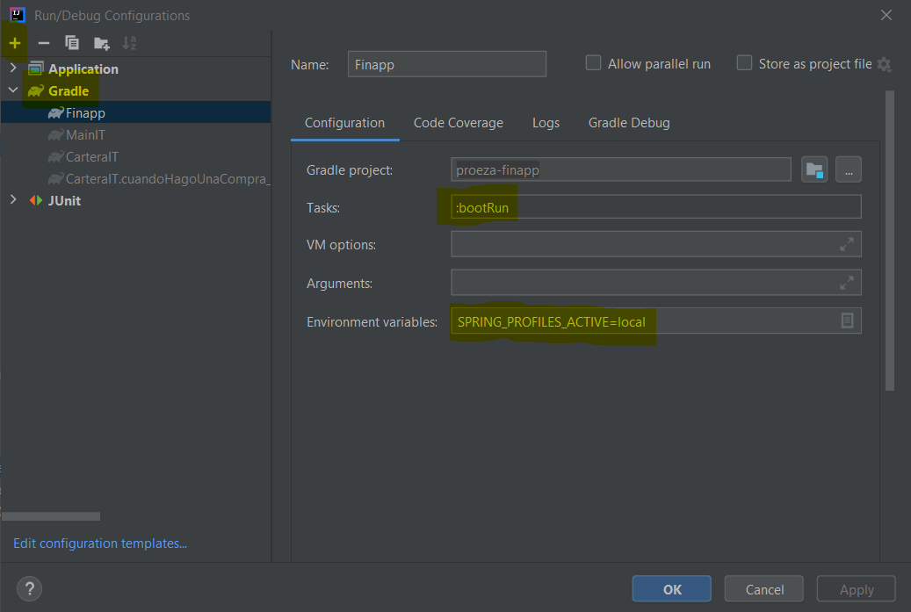

## RUN
**Opcion 1: Desde la consola**

 - Crear una variable de entorno habilitando el profile de spring que aplique 
> *Ejemplo:* 
>
> Para habilitar el profile local en windows
    `set SPRING_PROFILES_ACTIVE=local`

 - Correr el comando `gradlew bootRun`

**Opcion 2: Desde IntelliJ**

Crear una run configuration de gradle seteando la variable de entorno
